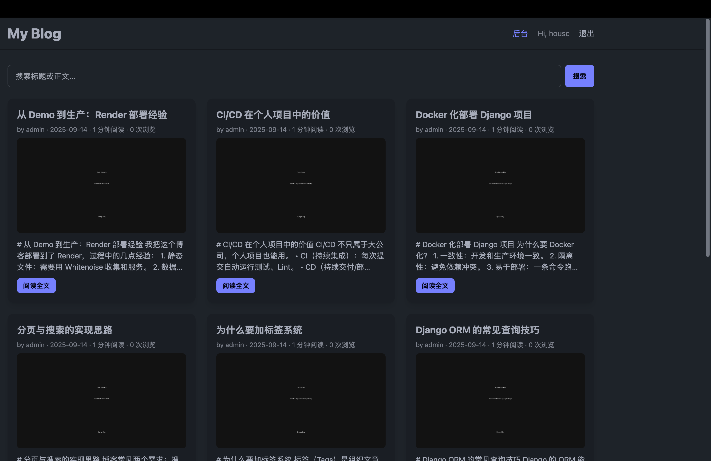
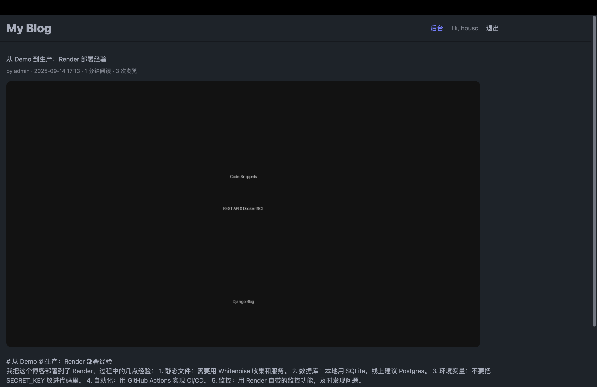
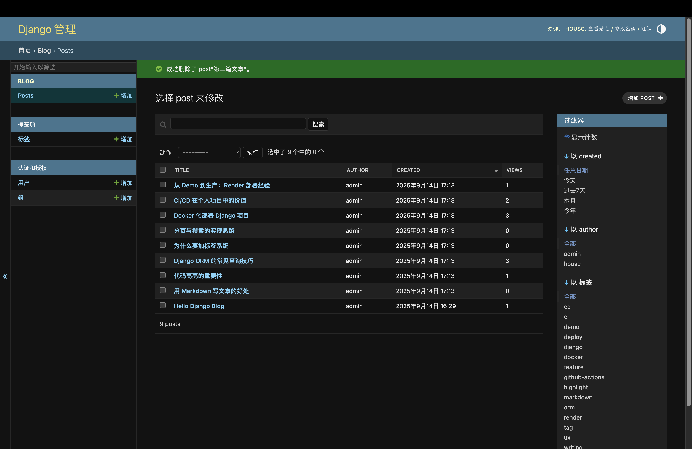
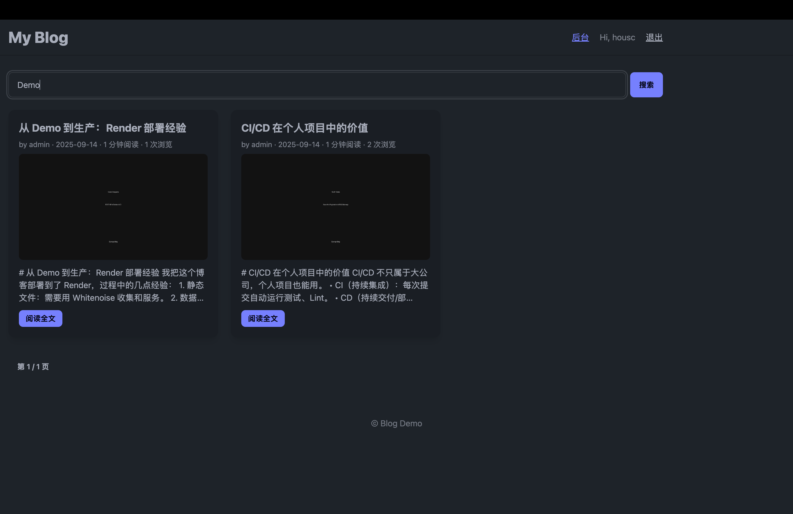

# Django Blog 
[](https://github.com/<houscmessi>/<Django-Blog>/actions)
[](https://django-blog-xyz.onrender.com)
[](./LICENSE)

> 一个 **干净、专业、可在线访问** 的 Django 博客模板：Markdown 渲染、代码高亮、标签、搜索、分页、RSS、Sitemap、只读 API、Docker、CI 与免费托管部署。


---

## ✨ 项目亮点
- 📝 **Markdown 渲染**（表格/代码块/TOC）+ **highlight.js** 代码高亮
- 🏷️ **标签**、🔎 **搜索**、📄 **分页**、⏱️ 阅读时长、👁️ 浏览计数
- 🖼️ **封面图上传**，首页卡片式列表，暗色 UI（Tailwind + DaisyUI）
- 🧭 **Sitemap**（`/sitemap.xml`）与 **RSS**（`/feed/`）
- 🔗 **只读 API（DRF）**：`/api/posts/`
- 🐳 **Docker 一键运行**，**GitHub Actions CI**
- ☁️ **Render 免费托管**部署说明（可 Docker / 非 Docker）
---
## 📦 目录结构
```bash
mysite/
mysite/ (settings, urls, wsgi)
blog/ (models, views, urls, api, feeds, sitemaps, admin)
templates/ (base, home, post_detail)
static/ (optional)
manage.py
requirements.txt
```
---

## 🚀 快速开始（本地）
```bash
pip install -r requirements.txt
python manage.py makemigrations
python manage.py migrate
python manage.py createsuperuser
python manage.py init_demo   # 生成示例文章
python manage.py runserver
#打开：http://127.0.0.1:8000/
#后台：/admin/
```
---
## 🐳 Docker 运行
```bash
docker compose up --build
```
---
## ☁️ Render托管
-非Docker：
```bash
#Build 
pip install -r requirements.txt && python manage.py collectstatic --noinput
#Start 
gunicorn mysite.wsgi:application -b 0.0.0.0:8000
```
-Docker：
```bash
直接识别 Dockerfile
演示数据：可在本地运行 init_demo 后将 db.sqlite3 一并提交（仅用于展示环境）
```
---
## 🧪 CI（GitHub Actions）
```bash
Lint（Black/Flake8）+ Django System Check + 迁移 Smoke
```
---

## 9) 迁移 & 启动（一次性执行）
```bash
pip install -r requirements.txt
python manage.py makemigrations
python manage.py migrate
python manage.py init_demo
python manage.py runserver 0.0.0.0:8000
```
## 📸 Screenshots

| Home (Desktop) | Post Detail | Admin |
|---|---|---|
|  |  |  |

**Search Results**



<details><summary>Mobile (optional)</summary>

</details>


